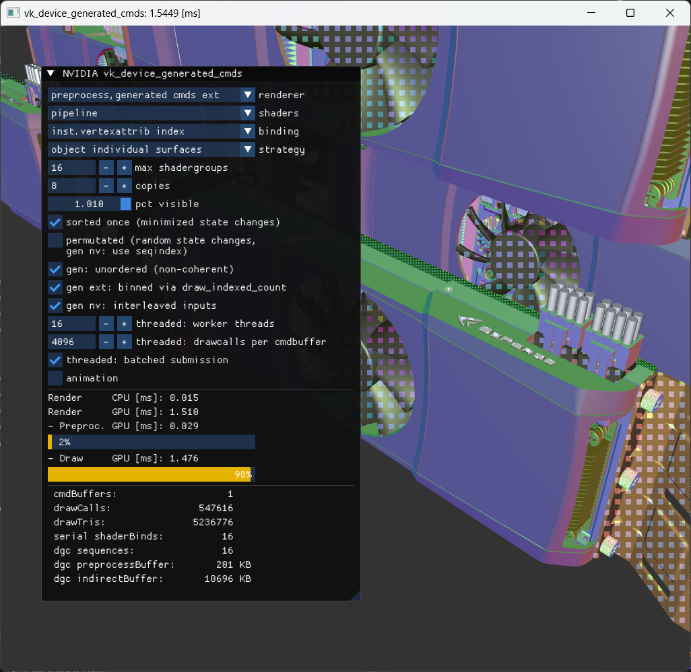

# Vulkan Device Generated Commands Sample

The "device generated cmds" sample demonstrates the use of the [VK_NV_device_generated_commands](https://www.khronos.org/registry/vulkan/specs/1.2-extensions/html/vkspec.html#VK_NV_device_generated_commands) (**DGC**) extension.
Furthermore, it showcases the bindless resource usage through passing GPU pointers as push constants, via **GLSL_EXT_buffer_reference** and **VK_EXT_buffer_device_address** (core features in Vulkan 1.2).

We recommend to have a look at this [blog post](https://devblogs.nvidia.com/new-vulkan-device-generated-commands) about the extension first.

The content being rendered in the sample is a CAD model which is made of many parts that have few triangles. Having such low complexity per draw-call can very often result into being CPU bound and also serves as stress test for the GPU's command processor.

The sample was a derived of the [threaded cadscene sample](https://github.com/nvpro-samples/gl_threaded_cadscene).
Please refer to its readme, as it explains the scene's principle setup.



## Options
### Renderer
Upon renderer activation the scene is traversed and encoded into a list of "drawitems". Optionally this list can be globally sorted once with the "min statechanges" option. All renderers operate from the same "drawitems" list.

- **re-used cmds**:
The entire scene is encoded in a single big command-buffer, and re-used every frame.
- **threaded cmds**:
Each thread has FRAMES many CommandBufferPools, which are cycled through. At the beginning the pool is reset and command-buffers are generated from it in chunks. Using another pool every frame avoids the use of additional fences.
Secondary commandbuffers are generated on the worker threads and passed for enqueing into a primary commandbuffer that is later submitted on the main thread.
- **generated cmds**:
Makes use of the DGC extension to generate the command buffer and render it (more details later).
- **preprocess,generated cmds**:
Uses the separate preprocess step of the DGC extension and then renders the command buffer (```VK_INDIRECT_COMMANDS_LAYOUT_USAGE_EXPLICIT_PREPROCESS_BIT_NV```). This allows us to measure the performance of the preprocessing operation in isolation. A separate preprocess may be useful to prepare work on an async compute queue.

### Strategy
- **drawcall individual**: Each CAD surface of an object has its own drawcall (tons, stress test)
- **material groups**: Drawcalls are combined based on materials within an object.

### Binding
- **dsetbinding**:
For each drawcall we bind a separate descriptor set with offset for material and matrix.  
The data is bound as ```VK_DESCRIPTOR_TYPE_UNIFORM_BUFFER_DYNAMIC```.
- **pushaddress**:
We provide the address of the material and matrix buffer data as push constants.  
In GLSL the data is accessed via 
[GLSL_EXT_buffer_reference](https://github.com/KhronosGroup/GLSL/blob/master/extensions/ext/GLSL_EXT_buffer_reference.txt). We acquire the buffer address through
```vkGetBufferDeviceAddress``` which is provided by either **VK_EXT_buffer_device_address**, **VK_KHR_buffer_device_address**, or Vulkan 1.2.

The reduce the amount of commands we do some level of redundancy filtering when generating the commands for each drawcall.
Because this scene has such few triangles per drawcall, this is highly recommended.

In the [scene.vert.glsl](scene.vert.glsl) and [scene.frag.glsl](scene.frag.glsl)  shaders check the ```UNIFORMS_TECHNIQUE``` define for differences.

### Shader Changes
A particular new feature that the DGC extension provides is the ability to switch shaders on the device. For that purpose
the sample generates 128 artificial vertex/fragment shader combinations, that generate polygon stippling patterns.

- **max shadergroups**: Sets the subset of active shaders that are used in the scene.

### Other
- **copies**: How many models are replicated in the scene (geometry buffers are re-used, but no hw instancing is used).
- **pct visible**: Percentage of visible drawcalls.
- **sorted once (minimized state changes)**: Global sorting of drawcalls depending on state.
- **permutated (random state changes, gen: use seqindex)**: Compute a random permutation of drawcalls (stresses state changes).  
The "generated" renderers make use of the ```VK_INDIRECT_COMMANDS_LAYOUT_USAGE_INDEXED_SEQUENCES_BIT_NV / sequencesIndexBuffer```.
- **gen: unordered (non-coherent)**: The "generate" renderers use the ```VK_INDIRECT_COMMANDS_LAYOUT_USAGE_UNORDERED_SEQUENCES_BIT_NV```.  
This allows the hardware to ignore the original drawcall ordering, which is recommended and a lot faster. However, it can introduce a bit more z-flickering due to re-ordering of drawcalls.
- **gen: interleaved inputs**: The inputs for the command generation are provided as single interleaved buffer (AoS). Otherwise each input has its own buffer section (SoA).
- **threaded: worker threads**: How many threads are used to generate the command buffers.
- **threaded: drawcalls per cmdbuffer**: How many drawcalls per command buffer.
- **threaded: batched submission**: Each thread collects all secondary command buffers and passes them once to the main thread.
- **animation**: Animates the matrices. 

## Device Generated Commands

For an overview on this extension, we recommend to have a look at this [article](https://devblogs.nvidia.com/new-vulkan-device-generated-commands).

There is a few principle steps:

1. Define a sequence of commands you want to generate as ```IndirectCommandsLayoutNV```
2. If you want the ability to change shaders, create your graphics pipelines with ```VK_PIPELINE_CREATE_INDIRECT_BINDABLE_BIT_NV``` and
   then create an aggregate graphice pipeline that imports those pipelines as graphics shader groups using ```VkGraphicsPipelineShaderGroupsCreateInfoNV```
   which extends ```VkGraphicsPipelineCreateInfo```.
3. Create a preprocess buffer based on sizing information acquired by ```vkGetGeneratedCommandsMemoryRequirementsNV```.
4. Fill your input buffer(s) for the generation step and setup ```VkGeneratedCommandsInfoNV``` accordingly.
5. Optionally use a separate preprocess step via ```vkCmdPreprocessGeneratedCommandsNV```.
6. Run the execution via ```vkCmdExecuteGeneratedCommandsNV```.

### Highlighted Files

* [nv_device_generated_commands.h](nv_device_generated_commands.h): contains the additions to the Vulkan API, as well as some very basic comments. The official extension spec integration can be found at [khronos](https://www.khronos.org/registry/vulkan/specs/1.2-extensions/html/chap44.html#VK_NV_device_generated_commands).
* [resources_vkgen.cpp](resources_vkgen.cpp): contains the additions to resources handling to support the device binding of shader groups.
  * ```ResourcesVKGen::initPipes()``` creates the graphics pipeline containing the shader groups.
* [renderer_vkgen.cpp](renderer_vkgen.cpp): contains the new renderers.
  * ```initGenerator``` creates the IndirectCommandsLayoutNV
  * ```setupInputInterleaved``` or ```setupInputSeparate``` show how the input buffers are filled
  * ```setupPreprocess``` handles the sizing and setup of the preprocess buffer
  * ```getGeneratedCommandsInfo cmdPreprocess cmdExecute``` are the functions used for generating the commands.

### Graphics Pipeline ShaderGroups

The ray tracing extension introduced the notion of "ShaderGroups" that are stored within a pipeline object.
This extension makes use of the same principle to store multiple shader groups within a graphics pipeline object.

Each shader group can override a subset of the pipeline's state:

``` cpp
typedef struct VkGraphicsShaderGroupCreateInfoNV
{
  // A shadergroup, is a set of unique shader combinations (VS,FS,...) etc.
  // that all are stored within a single graphics pipeline that share
  // most of the state.
  // Must not mix mesh with traditional pipeline.
  VkStructureType sType;
  const void*     pNext;

  // overrides createInfo from original graphicsPipeline
  uint32_t                                          stageCount;
  const VkPipelineShaderStageCreateInfo*            pStages;
  const VkPipelineVertexInputStateCreateInfo*       pVertexInputState;
  const VkPipelineTessellationStateCreateInfo*      pTessellationState;
} VkGraphicsShaderGroupCreateInfoNV;

``` cpp
typedef struct VkGraphicsPipelineShaderGroupsCreateInfoNV
{
  // extends regular VkGraphicsPipelineCreateInfo
  // If bound via vkCmdBindPipeline will behave as if pGroups[0] is active,
  // otherwise bind using vkCmdBindPipelineShaderGroup with proper index
  VkStructureType                          sType;
  const void*                              pNext;

  uint32_t                                 groupCount;
  const VkGraphicsShaderGroupCreateInfoNV* pGroups;
  
  uint32_t                                 pipelineCount;
  const VkPipeline*                        pPipelines;
} VkGraphicsPipelineShaderGroupsCreateInfoNV;
```
You can bind a shader group using ```vkCmdBindPipelineShaderGroupNV(.... groupIndex)```.
However the primary use-case is to bind them indirectly on the device.

> Important Note: To make any graphics pipeline bindable by the device set the ```VK_PIPELINE_CREATE_INDIRECT_BINDABLE_BIT_NV``` flag.
> This is also true for imported pipelines.

To speed up creation of a pipeline that contains many pipelines, you can pass existing
pipelines to be referenced via ```pPipelines```. You must ensure that those referenced
pipelines are alive as long as the referencing pipeline is alive.
The referenced pipelines must match in all state, except for what can be overridden
per shader group. The shader groups from such imported pipelines are virtually appended in order of 
the array.

With this mechanism you can easily collect existing pipelines (thought don't forget the bindable flag and the state compatibility),
which should ease the integration of this technology.


### IndirectCommandsLayoutNV

The DGC extension allows you to generate some common graphics commands on the device based on a pre-defined sequence of command tokens.
This sequence is encoded in the ```IndirectCommandsLayoutNV``` object.

The following pseudo code illustrates the kind of state changes you can make.
You will see that there is no ability to change the descriptor set bindings, which is why
this sample showcases the passing of bindings via push constants.
This is somewhat similar to ray tracing as well, where you manage all resources globally
as well.

``` cpp
void cmdProcessSequence(cmd, pipeline, indirectCommandsLayout, pIndirectCommandsStreams, s)
{
  for (uint32_t t = 0; t < indirectCommandsLayout.tokenCount; t++){
    token = indirectCommandsLayout.pTokens[t];

    uint32_t stride   = indirectCommandsLayout.pStreamStrides[token.stream];
    stream            = pIndirectCommandsStreams[token.stream];
    uint32_t offset   = stream.offset + stride * s + token.offset;
    const void* input = stream.buffer.pointer( offset )

    switch(input.type){
    VK_INDIRECT_COMMANDS_TOKEN_TYPE_SHADER_GROUP_NV:
      VkBindShaderGroupIndirectCommandNV* bind = input;

      // the pipeline must have been created with
      // VK_PIPELINE_CREATE_INDIRECT_BINDABLE_BIT_NV

      vkCmdBindPipelineShaderGroupNV(cmd, indirectCommandsLayout.pipelineBindPoint,
        pipeline, bind->groupIndex);
    break;

    VK_INDIRECT_COMMANDS_TOKEN_TYPE_STATE_FLAGS_NV:
      VkSetStateFlagsIndirectCommandNV* state = input;

      if (token.indirectStateFlags & VK_INDIRECT_STATE_FLAG_FRONTFACE_BIT_NV){
        if (state.data & (1 << 0)){
          setState(VK_FRONT_FACE_CLOCKWISE);
        } else {
          setState(VK_FRONT_FACE_COUNTER_CLOCKWISE);
        }
      }
    break;

    VK_INDIRECT_COMMANDS_TOKEN_TYPE_PUSH_CONSTANT_NV:
      uint32_t* data = input;

      vkCmdPushConstants(cmd,
        token.pushconstantPipelineLayout
        token.pushconstantStageFlags,
        token.pushconstantOffset,
        token.pushconstantSize, data);
    break;

    VK_INDIRECT_COMMANDS_TOKEN_TYPE_INDEX_BUFFER_NV:
      VkBindIndexBufferIndirectCommandNV* data = input;

      // the indexType may optionally be remapped
      // from a custom uint32_t value, via
      // VkIndirectCommandsLayoutTokenNV::pIndexTypeValues
      
      vkCmdBindIndexBuffer(cmd,
        deriveBuffer(data->bufferAddress),
        deriveOffset(data->bufferAddress),
        data->indexType);
    break;

    VK_INDIRECT_COMMANDS_TOKEN_TYPE_VERTEX_BUFFER_NV:
      VkBindVertexBufferIndirectCommandNV* data = input;

      // if token.vertexDynamicStride is VK_TRUE
      // then the stride for this binding is set
      // using data->stride as well

      vkCmdBindVertexBuffers(cmd,
        token.vertexBindingUnit, 1,
        &deriveBuffer(data->bufferAddress),
        &deriveOffset(data->bufferAddress));
    break;

    VK_INDIRECT_COMMANDS_TOKEN_TYPE_DRAW_INDEXED_NV:
      vkCmdDrawIndexedIndirect(cmd,
        stream.buffer, offset, 1, 0);
    break;

    VK_INDIRECT_COMMANDS_TOKEN_TYPE_DRAW_NV:
      vkCmdDrawIndirect(cmd,
        stream.buffer,
        offset, 1, 0);
    break;

    // only available if VK_NV_mesh_shader is supported
    VK_INDIRECT_COMMANDS_TOKEN_TYPE_DISPATCH_NV:
      vkCmdDrawMeshTasksIndirectNV(cmd,
        stream.buffer, offset, 1, 0);
    break;
    }
  }
}
```

The sequence generation itself is also influenced by a few usage flags, as follows:

``` cpp
cmdProcessAllSequences(
    cmd, pipeline, indirectCommandsLayout, pIndirectCommandsTokens,
    maxSequencesCount,
    sequencesCountBuffer, sequencesCount, 
    sequencesIndexBuffer, sequencesIndexOffset)
{
  uint32_t sequencesCount = sequencesCountBuffer ?
    min(maxSequencesCount, sequencesCountBuffer.load_uint32(sequencesCountOffset) :
    maxSequencesCount;


  for (s = 0; s < sequencesCount; s++)
  {
    uint32_t sUsed = s;

    if (indirectCommandsLayout.flags & VK_INDIRECT_COMMANDS_LAYOUT_USAGE_INDEXED_SEQUENCES_BIT_NV) {
      sUsed = sequencesIndexBuffer.load_uint32( sUsed * sizeof(uint32_t) + sequencesIndexOffset);
    }

    if (indirectCommandsLayout.flags & VK_INDIRECT_COMMANDS_LAYOUT_USAGE_UNORDERED_SEQUENCES_BIT_NV) {
      sUsed = incoherent_implementation_dependent_permutation[ sUsed ];
    }

    cmdProcessSequence(cmd, pipeline, indirectCommandsLayout, pIndirectCommandsTokens, sUsed);
  }
}
```

### Preprocess Buffer

The NVIDIA implementation of the DGC extension currently needs some device space to generate the commands prior their execution.
The preprocess buffer provides this space, and is sized via ```vkGetGeneratedCommandsMemoryRequirementsNV```.

As you can see below, it depends on the pipeline, as well as the indirectCommandsLayout and the number of maximum
sequences you may generate. Most sizing information is based on the token type alone, however there can be some variable costs.
Especially the complexity of the shader group changes influences the number of bytes a lot. The more similar the shader groups
are, the less memory will be required.

``` cpp
typedef struct VkGeneratedCommandsMemoryRequirementsInfoNV
{
  VkStructureType                     sType;
  const void*                         pNext;

  VkPipelineBindPoint                 pipelineBindPoint;
  VkPipeline                          pipeline;
  
  VkIndirectCommandsLayoutNV          indirectCommandsLayout;

  uint32_t                            maxSequencesCount;
} VkGeneratedCommandsMemoryRequirementsInfoNV;
```

The sample shows the size of the buffer in the UI as **"outputBuffer ... KB"**.
As of writing, the size may be substantial for a very large number of drawcalls.
If you need to stay within a memory budget, you can split your execution into multiple passes
and re-use the preprocess memory.

If you make use of the dedicated preprocess step through ```vkCmdPreprocessGeneratedCommandsNV```, then you must
ensure all inputs (all buffer content etc.) are the same at execution time. An implementation is allowed to split
the workload required for execution into these two functions.

You can see the time it takes to preprocess in the UI as **"Preproc. GPU [ms]"** if you selected the **preprocess,generate cmds** renderer.

### Performance

Preliminary results from **Quadro RTX 6000, Intel i7-6850K, Windows 10 64-bit**.
The settings can be seen in the screenshot, and are deliberately set as stress test,
with very few triangles per drawcall (we do not recommend this, you will become
front-end bound and GPU scalability will suffer):

* ~ 540 000 drawcalls
* ~ 5.2 M triangles (i.e. in average only 10 triangles per drawcall)
* ~ 70 000 shaderbinds (alternating between 16 shadergroups)
* device generated commands setup
  * 6 tokens: SHADER_GROUP, INDEX_BUFFER, VERTEX_BUFFER, PUSH_CONSTANT (vertex), PUSH_CONSTANT (fragment), DRAW_INDEXED
  * ~ 132 MB preprocess buffer size

We account the time it takes to generate the commands on the CPU as "preprocess"
time.

renderer                         | preprocess [ms] | draw (GPU) [ms]| 
-------------------------------- | --------------- | ------------- |
re-used cmds                     |  0.0 (CPU)      |  11.1         |
threaded cmds (6 threads)        |  3.8 (CPU)      |  11.9         |
preprocess,generated (ordered)   |  0.8 (GPU)      |   9.3         |
preprocess,generated (unordered) |  0.2 (GPU)      |   9.3         |

The test shows that generating the commands on the GPU can be pretty fast
even when generating a lot of drawcalls. For best performance we recommend
the **unordered** version. 

At the time of writing and in this particular stress-test the draw time
on the GPU was reduced, as the graphics pipeline containing the many
shader groups allows faster state transitions between them. The cost
for this is some additional work when creating the container pipeline
state object.

> However, we want to stress again, that the main goal of this
> extension is not generating so much work or simply moving things on the GPU, 
> but leveraging it to reduce the actual work needed.
>
> For example by using [occlusion culling](https://github.com/nvpro-samples/gl_occlusion_culling),
> or other techniques that allow you to reduce the required workload
> on the device.

## Building
Make sure to have installed the [Vulkan-SDK](http://lunarg.com/vulkan-sdk/). Always use 64-bit build configurations.

Ideally clone this and other interesting [nvpro-samples](https://github.com/nvpro-samples) repositories into a common subdirectory. You will always need [shared_sources](https://github.com/nvpro-samples/shared_sources) and on Windows [shared_external](https://github.com/nvpro-samples/shared_external). The shared directories are searched either as subdirectory of the sample or one directory up.

If you are interested in multiple samples, you can use [build_all](https://github.com/nvpro-samples/build_all) CMAKE as entry point, it will also give you options to enable/disable individual samples when creating the solutions.
